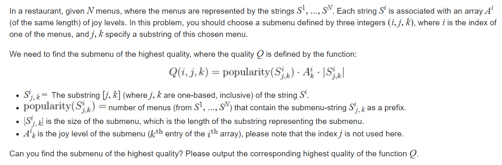

<link rel="stylesheet" href="https://cdn.jsdelivr.net/npm/katex@0.11.1/dist/katex.min.css" integrity="sha384-zB1R0rpPzHqg7Kpt0Aljp8JPLqbXI3bhnPWROx27a9N0Ll6ZP/+DiW/UqRcLbRjq" crossorigin="anonymous">
<script defer src="https://cdn.jsdelivr.net/npm/katex@0.11.1/dist/katex.min.js" integrity="sha384-y23I5Q6l+B6vatafAwxRu/0oK/79VlbSz7Q9aiSZUvyWYIYsd+qj+o24G5ZU2zJz" crossorigin="anonymous"></script>
<script defer src="https://cdn.jsdelivr.net/npm/katex@0.11.1/dist/contrib/auto-render.min.js" integrity="sha384-kWPLUVMOks5AQFrykwIup5lo0m3iMkkHrD0uJ4H5cjeGihAutqP0yW0J6dpFiVkI" crossorigin="anonymous" onload="renderMathInElement(document.body);"></script>

String related problems used to scare the shit out of me. Then I was introduced to some string suffix structures and it absolutely blew my mind. I don&#39;t claim to be an expert on suffix structures, but I hope my approach to solve the following problems will help you get some insight.

Please keep in mind that this article is **in no way an introduction** to these data structures. I&#39;ll attach some links at the end. Read them to understand how these data structures work.

Let&#39;s start then.

##  **Codeforces GYM 101991E- Exciting Menus**

Problem statement:



Problem link: [Exciting Menus - Codeforces](https://codeforces.com/gym/101991/problem/E)

Let&#39;s think about the popularity of a substring first. If this was the only thing that we were asked to find, then a **trie** would suffice. Length of the prefix is also easy to maintain in a trie. The only thing remaining is the _joy level_.

It&#39;s pretty apparent that if we have multiple occurrences of a substring, then we should take the highest _joy level_ corresponding to that substring. I don&#39;t think we can do that with a normal trie. Here&#39;s where **Aho-Corasick** comes into play.

Think what the _fail link_ of an Aho-Corasick node means. It points to the node with the maximum prefix match with the suffix of the original node. Suppose we have a prefix ${\text{\textquoteleft} aab \text{\textquoteright}}$ . Then the node corresponding to this prefix must be a _fail link/suffix link_ to a prefix ending with ${\text{\textquoteleft} aab \text{\textquoteright}}$ , right? Then that node will be a _suffix link_ to another node ending with ${\text{\textquoteleft} aab \text{\textquoteright}}$ and so on.

Now, we will make another graph where we will add a directed edge from the suffix link node to the original node. For example, if the suffix link of a prefix ${\text{\textquoteleft} bccab \text{\textquoteright}}$ goes to the prefix ${\text{\textquoteleft} aab \text{\textquoteright}}$, then we will add a directed edge from ${\text{\textquoteleft} aab \text{\textquoteright}}$ to ${\text{\textquoteleft} bccab \text{\textquoteright}}$. This graph will be a rooted tree. In this newly formed graph, the descendants of ${\text{\textquoteleft} aab \text{\textquoteright}}$ will be the prefixes which have ${\text{\textquoteleft} aab \text{\textquoteright}}$ as their suffix. So, if we know the maximum _joy level_ of the descendants of ${\text{\textquoteleft} aab \text{\textquoteright}}$, we can assign that value to ${\text{\textquoteleft} aab \text{\textquoteright}}$ ,  pretty cool right?

Now, we&#39;ll just traverse through each node of the **Aho-Corasick** automaton and use the formula on each of them to find out the answer.

Here&#39;s my code:
```c++
#include <bits/stdc++.h>
#define N 100007
#define ll long long
#define pii pair<int,int>
#define ff first
#define ss second
using namespace std;

std::vector<int> adj[N];
string s[N];
int node[N][27];
int vis[N];
int val[N];
int backnode[N];
int cnt[N];
bool ending[N];
int id;
int ln[N];
int arr[N];
ll ans;
int depth[N];
inline void init()
{
    id = 0;
    for (int i = 0; i < 26; i++)
        node[id][i] = 0;
}

inline int newnode()
{
    id++;
    for (int i = 0; i < 26; i++)
    {
        node[id][i] = 0;
    }
    backnode[id] = 0;
    cnt[id] = 0;
    val[id] = 0;
    ending[id] = 0;
    depth[id] = 0;
    return id;
}
inline void Insert(string &st)
{
    int u = 0;
    int n = st.size();
    for (int i = 0; i < n; i++)
    {
        int x = st[i] - 'a';
        if (!node[u][x]) node[u][x] = newnode();
        u = node[u][x];
        val[u] = max(val[u], arr[i]);
        cnt[u]++;
        depth[u] = i + 1;
    }

    ending[u] = 1;
}

inline void AhoCorasik()
{
    queue<int>q;
    for (int i = 0; i < 26; i++)
    {
        if (node[0][i])
        {
            q.push(node[0][i]);
            backnode[node[0][i]] = 0;
        }
    }
    while (!q.empty())
    {
        int u = q.front();
        int w = backnode[u];
        adj[w].push_back(u);
        q.pop();

        for (int i = 0; i < 26; i++)
        {
            int v = node[u][i];
            if (v)
            {
                q.push(v);
                backnode[v] = node[backnode[u]][i];
            }
            else
            {
                node[u][i] = node[backnode[u]][i];
            }
        }
    }
}

void dfs(int x)
{
    ans = max( ans, 1LL * depth[x] * val[x] * cnt[x] );

    for ( auto v : adj[x] )
    {
        dfs(v);
    }
}

int traverse(int x)
{
    for ( auto v : adj[x] )
    {
        val[x] = max(val[x], traverse(v));
    }

    return val[x];
}

int main()
{
    ios_base::sync_with_stdio(0);
    cin.tie(0);

    freopen("exciting.in", "r", stdin);

    int tc;
    cin >> tc;

    while (tc--)
    {
        init();

        ans = 0;
        int n;
        cin >> n;

        for ( int i = 0; i < n; i++ )
        {
            cin >> s[i];
            ln[i] = s[i].size();
        }

        for ( int i = 0; i < n; i++ )
        {
            for ( int j = 0; j < ln[i]; j++ )
                cin >> arr[j];

            Insert(s[i]);
        }

        AhoCorasik();
        int k = traverse(0);
        dfs( 0 );

        for( int i=0;i<=id;i++ )
            adj[i].clear();

        cout << ans << "\n";
    }
}
```

##  **Codeforces 1202E-**  **You Are Given Some Strings...**

Problem statement:


Problem link: [You Are Given Some Strings.. - Codeforces](https://codeforces.com/contest/1202/problem/E)

Since the constraints are in the ${ \ 2.10^5 }$ ballpark, we can&#39;t even dare to think of bruteforce here. Even though the problem deals with string concatenation, we&#39;ll now see why we don&#39;t need to concatenate anything.

Let, 
$ {f(i)= \mathrm{Number \thinspace of \thinspace query \thinspace strings \thinspace \bm{starting} \thinspace at \thinspace position \thinspace \bm{i}} } $

$ {g(i)= \mathrm{Number \thinspace of \thinspace query \thinspace strings \thinspace \bm{ending} \thinspace at \thinspace position \thinspace \bm{i}} } $

Then the answer is ${\displaystyle\sum_{i=1}^n f(i).g(i) }$

Now, our next challenge is to figure out how we can calculate ${f(i)}$ and ${g(i)}$.

Let&#39;s have a look at ${f(i)}$ first. We can define ${f(i)}$ like this as well:

${f(i)= \mathrm{Number \thickspace of \thickspace query \thickspace strings \thickspace that \thickspace are \thickspace prefixes \thickspace of \thickspace the \thickspace suffix \thickspace starting \thickspace at \thickspace position \thickspace \bm{i} }}$

We can find out the number of times a prefix of a suffix repeats in a string using suffix array. Since suffix array is always sorted, the occurrence of any prefix in a suffix will always be consecutive. So let&#39;s build a suffix array using the string ${ \boldsymbol {t} }$. Now for every query string, we can find out how many times it has occurred in string ${ \boldsymbol {t} }$ using binary search. We will get a range in the suffix array where a query string occurs. We&#39;ll then increment the counter for each position in the range. That&#39;s it! We&#39;re done with ${f(i)}$.

Now getting back to ${g(i)}$, we can observe that this is exactly ${f(i)}$ for the reversed version of the string ${ \boldsymbol{t} }$! To calculate ${g(i)}$, we can just reverse t and perform the same operations as we did for ${f(i)}$.

Now we can just loop through each position and calculate the answer.

My code:

```c++
#include<bits/stdc++.h>
#define ll long long
#define M 200007
#define mod 1000000007
using namespace std;
const int kinds = 256;///maximum ASCII value of any character of the string
int nn;
char str[M];
int K, buc[M], r[M], sa[M], X[M], Y[M], high[M];
bool cmp(int *r, int a, int b, int x)
{
    return (r[a] == r[b] && r[a + x] == r[b + x]);
}
vector<int>saa;
int lcp[M];

string t, s;
int n, m;

void suffix_array_DA(int n, int m)
{
    int *x = X, *y = Y, i, j, k = 0, l;
    memset(buc, 0, sizeof(buc));
    for (i = 0; i < n; i++)
        buc[ x[i] = str[i] ]++;
    for (i = 1; i < m; i++)
        buc[i] += buc[i - 1];
    for (i = n - 1; i >= 0; i--)
        sa[--buc[x[i]]] = i;
    for (l = 1, j = 1; j < n; m = j, l <<= 1)
    {
        j = 0;
        for (i = n - l; i < n; i++)
            y[j++] = i;
        for (i = 0; i < n; i++)
            if (sa[i] >= l)
                y[j++] = sa[i] - l;
        for (i = 0; i < m; i++)
            buc[i] = 0;
        for (i = 0; i < n; i++)
            buc[ x[y[i]] ]++;
        for (i = 1; i < m; i++)
            buc[i] += buc[i - 1];
        for (i = n - 1; i >= 0; i--)
            sa[ --buc[ x[y[i]] ]] = y[i];
        for (swap(x, y), x[sa[0]] = 0, i = 1, j = 1; i < n; i++)
            x[sa[i]] = cmp(y, sa[i - 1], sa[i], l) ? j - 1 : j++;
    }
    for (i = 1; i < n; i++)
        r[sa[i]] = i;
    for (i = 0; i < n - 1; high[r[i++]] = k)
        for (k ? k-- : 0, j = sa[r[i] - 1]; str[i + k] == str[j + k]; k++);
}
void suffix_array_construction(string s)
{
    int n = s.size();
    for (int i = 0; i < n; i++)
        str[i] = s[i];
    str[n] = '\0';
    suffix_array_DA(n + 1, kinds);

    for (int i = 1; i <= n; i++)
        saa.push_back(sa[i]);
}
void lcp_construction(string const& s, vector<int> const& p)
{
    int n = s.size();
    vector<int> rank(n, 0);
    for (int i = 0; i < n; i++)
        rank[p[i]] = i;
    int k = 0;

    for (int i = 0; i < n; i++)
    {
        if (rank[i] == n - 1)
        {
            k = 0;
            continue;
        }
        int j = p[rank[i] + 1];
        while (i + k < n && j + k < n && s[i + k] == s[j + k])
            k++;
        lcp[rank[i]] = k;
        if (k)
            k--;
    }
}

bool greaterEqual(int sp, int n, const string &ps) {
    int spl = n - sp, sps = ps.size(), o = min(spl, sps);
    for (int i = 0; i < o; i++) {
        if (t[sp + i] > ps[i]) return 1;
        else if (t[sp + i] < ps[i]) return 0;
    }
    return spl >= sps;
}

bool greaterByVal(int sp, int n, const string &ps) {
    int spl = n - sp, sps = ps.size(), o = min(spl, sps);
    for (int i = 0; i < o; i++) {
        if (t[sp + i] > ps[i]) return 1;
        else if (t[sp + i] < ps[i]) return 0;
    }
    return 0;
}

pair<int, int> rangeString(int n, const string &ps) {  // returns [a,b) , not [a,b]
    int lo = 0, hi = n - 1, l = n, r = n;
    while (lo <= hi) {
        auto mid = (lo + hi) >> 1;
        if (greaterEqual(saa[mid], n, ps)) l = mid, hi = mid - 1;
        else lo = mid + 1;
    }
    lo = l, hi = n - 1;
    while (lo <= hi) {
        auto mid = (lo + hi) >> 1;
        if (greaterByVal(saa[mid], n, ps)) r = mid, hi = mid - 1;
        else lo = mid + 1;
    }
    return {l, r};
}

bool match(int mid)
{
    int cnt = 0;

    for ( int j = 0, k = mid; j < m and k < n; j++, k++ )
    {
        if ( t[k] == s[j] )
            cnt++;
        else
            break;
    }

    if (cnt >= m)
        return 1;
    return 0;
}

ll st[M], en[M];
ll shuru[M], shesh[M];
string ss[M];

int main()
{
    ios_base::sync_with_stdio(0);
    cin.tie(0);

    cin >> t;
    n = t.size();
    suffix_array_construction(t);
    lcp_construction(t, saa);
    nn = saa.size();

    int q;
    cin>>q;

    for ( int i = 0; i < q; i++ )
    {
        cin >> ss[i];

        pair<int,int>strRange= rangeString(n,ss[i]);

        st[strRange.first]++;
        st[strRange.second]--;  // [a,b)
    }

    for( int i=1;i<n;i++ )
        st[i]+= st[i-1];
    for( int i=0;i<n;i++ )
        shuru[saa[i]]= st[i];
    
    saa.clear();

    reverse(t.begin(), t.end());
    suffix_array_construction(t);
    lcp_construction(t, saa);

    for ( int i = 0; i < q; i++ )
    {
        reverse( ss[i].begin(), ss[i].end() );

        pair<int,int>strRange= rangeString(n,ss[i]);

        en[strRange.first]++;
        en[strRange.second]--;  // [a,b)
    }
    

    for( int i=1;i<n;i++ )
        en[i]+= en[i-1];
    for( int i=0;i<n;i++ )
        shesh[n-saa[i]-1]= en[i];

    ll ans= 0;

    for( int i=1;i<n;i++ )
        ans+= ( shuru[i]*shesh[i-1] );
    
    cout<< ans ;
}
```

## **Toph- Distinctness**

Problem statement:


Problem link: [Distinctness- Toph](https://toph.co/p/distinctness)

Let&#39;s get straight to the point. If you know how **suffix automaton** actuallyworks, this is a straightforward problem for you.

Each node in a suffix automaton corresponds to one or more **unique** substrings of the original string. What do they have in common? All of those substrings end in the same position(s) in the original string. Everytime we add a new character at the end of the original string, we create **at least 1** new substring (why?). Suppose we have a string ${\text{\textquoteleft} aab \text{\textquoteright}}$ and we have created a suffix automaton using this string. If we add a ${\text{\textquoteleft} c \text{\textquoteright}}$ at the end, we know for sure that we&#39;re creating a new unique substring of length 4 (${\text{\textquoteleft} aabc \text{\textquoteright}}$). If we add this character to the automaton, the string ${\text{\textquoteleft} aabc \text{\textquoteright}}$ will belong to a node that corresponds to all the unique substrings that end at position 4. This means that we know how many unique substrings end at position 4; which implies that we have found out the number of new unique substrings we have created. If the substring ${\text{\textquoteleft} aabc \text{\textquoteright}}$ belongs to the node ${\mathrm{curr}}$ , then 
The number of new substrings= ${\mathrm{ len(curr)-len(suffixLink(curr))}}$ .

${\mathrm{ans(i)= ans(i-1)+len(curr)-len(suffixLink(curr))}}$

My code:

```c++
#include<bits/stdc++.h>
#define ll long long
#define sc second
#define mod 1000000007
#define mx 400010
#define inf 2e9
using namespace std;

char s[mx];
bool f;
ll ans;

class Automata
{
public:
    struct data
    {
        int link, len, cnt, dist;
        int valid = 0;
        int next[27] ;

        data() {}
        data(int link, int len) : link(link), len(len) {}
    };

    data *node ;
    bool visfordfs[mx];
    int num, last ;
    set< pair<int, int> > st;

    void reset()
    {
        num = 1 ;

        node[0].valid = 0;
        node[0].link = -1 ;
        node[0].len = 0 ;
        node[0].cnt = 0 ;
        last = 0 ;
        memset(node[0].next, 0, sizeof(node[0].next));
    }

    Automata() {}
    Automata(int mx_len)
    {
        mx_len += 7 ;
        mx_len = mx_len * 2 ;
        node = new data[mx_len] ;

        memset(visfordfs, 0, sizeof(visfordfs));

        reset();
    }

    void addLetter(char ch)
    {
        int cur = num++;
        int let = ch - 'a' ;
        int p = last ;

        if (f)
            node[cur].valid= 1;

        node[cur].len = node[last].len + 1 ;
        node[cur].cnt = 1;
        st.insert({node[cur].len, cur});
        memset(node[cur].next, 0, sizeof(node[cur].next));

        for (p = last ; p != -1 && !node[p].next[let] ; p = node[p].link)
            node[p].next[let] = cur ;

        if (p == -1)
            node[cur].link = 0 ;

        else
        {
            int q = node[p].next[let] ;

            if (node[p].len + 1 == node[q].len)
                node[cur].link = q ;

            else
            {
                int clone = num++;

                node[clone] = node[q] ;
                node[clone].len = node[p].len + 1 ;
                node[clone].valid= 0;
                node[clone].cnt = 0;
                st.insert({node[clone].len, clone});

                for (; p != -1 && node[p].next[let] == q ; p = node[p].link)
                    node[p].next[let] = clone ;

                node[q].link = node[cur].link = clone ;
            }
        }

        if( node[cur].link>-1 )
            ans+= node[cur].len-node[node[cur].link].len; // Adding the new ones

        last = cur ;
    }

    void count_sub_str()
    {
        for ( auto it = st.rbegin(); it != st.rend(); it++ )
        {
            node[ node[it->sc].link ].cnt += node[it->sc].cnt;
        }
    }
    void count_valid_sub_str()
    {
        for ( auto it = st.rbegin(); it != st.rend(); it++ )
        {
            node[ node[it->sc].link ].valid += node[it->sc].valid;
        }
    }
    

    void count_dist_str( int x )
    {
        if ( node[x].dist )
            return;

        node[x].dist = 1;

        for ( int i = 0; i < 26; i++ )
            if ( node[x].next[i] )
            {
                count_dist_str( node[x].next[i] );
                node[x].dist += node[ node[x].next[i] ].dist ;
            }
    }
};

Automata sa;

int main()
{
    int sz;
    
    scanf("%s", s);
    sz= strlen(s);

    sa = Automata( sz );

    for ( int i = 0; i < sz; i++ )
    {
        sa.addLetter( s[i] );
        cout<<ans<<"\n";
    }

}
```